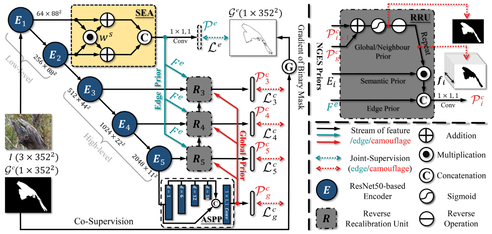
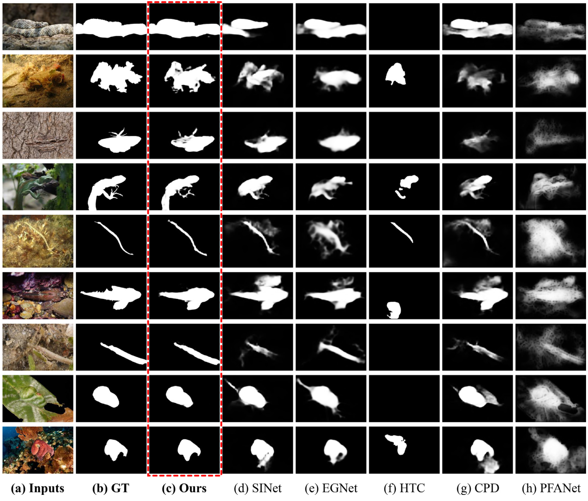

# 
`ERRNet [Pattern Recognition @2022]`

- **Title:** Fast Camouflaged Object Detection via Edge-based Reversible Re-calibration Network
- **Authors:** Ge-Peng Ji, Lei Zhu, Mingchen Zhuge, Keren Fu*
- **Paper link:** [Elsevier Website](https://www.sciencedirect.com/science/article/pii/S0031320321005902) and [arXiv](https://arxiv.org/abs/2111.03216).

> Our project is under construction. If you find some bugs, please let me konw or directly pull request in the github. Contact E-mail: gepengai.ji@gmail.com.

# Introduction

In this work, we propose a Edge-based Reversible Re-calibration Network (ERRNet) for camouflaged object detection. It consists of a selective edge aggregation (SEA) module and a reversible re-calibration unit (RRU), which are cooperating closely with NEGS priors (i.e., Neighbour prior, Global prior, Edge prior, and Semantic prior) at low-/high-level layers. The SEA aggregation strategy is exploited to mine the edge prior and prevent the weakness edge vanishing problem, while the RRU is responsible for re-calibrating the coarse prediction. Our ERRNet reaches the 1st place on three COD datasets, and also outperforms existing cutting-edge models on five medical image segmentation datasets. Further, we have provided comprehensive ablation studies, making ERRNet a general and robust architecture in the COD task.

      
    <em> 
    Figure 1: The overall pipeline of the proposed ERRNet that contains three main cooperative components, including Atrous Spatial Pyramid Pooling (ASPP) for initiating global prior, Selective Edge Aggregation (SEA) for generating edge prior, and Reversible Re-calibration Unit (RRU) for modulating and refining the NGES Priors in a cascaded manner.
    </em>

# Code Usage

- Download the [training](https://drive.google.com/file/d/1bTIb2qo7WXfyLgCn43Pz0ZDQ4XceO9dE/view?usp=sharing) & [testing](https://drive.google.com/file/d/120wKRvwXpqqeEejw60lYsEyZ4SOicR3M/view?usp=sharing) dataset from google drive website.
- Download the snapshot file from [Google Driver](https://drive.google.com/file/d/1z0RFqIEqQegfWyTBKztbvrYo-vTGT7LL/view?usp=sharing) and put it on `./snapshot/ERRNet_Snapshot.pth`.
- Inference: Just run `test.py` script to get the final predictions.

# Prediction Results

Our results reported in our PR journal can be downloaded in here: [Google Drive](https://drive.google.com/file/d/10i3g4XPBz76nMfU9wZEsKbvmeurSs1Qm/view?usp=sharing).

      
    <em> 
    Figure 2: Visual comparison of camouflaged object detection maps produced by different methods. (a) Input images, (b) GT, which stands for the ground truths, (c) camouflaged object detection maps produced by our method, (d) SINet [1], (e) EGNet [24], (f) HTC [20], (g) CPD [23], and (h) PFANet [60].
    </em>

**UPDATED NOTE:** Recently, we also retrain our method, which again obtains a new improvement compared with previous performance. Note that the retrained model performs slightly different from the original performance reported in the paper, which is due to randomness in the training phase. The latest results can be found here: [Google Drive](https://drive.google.com/file/d/1GSS8nF5OoIpR0l17qwVfgXzujY9nNw1a/view?usp=sharing), which contains four test dataset (ie., CHAMELEON, CAMO, COD10K, NC4K).

# Citation

If you find this project useful, please consider citing:

    @article{ji2022fast,
      title = {Fast Camouflaged Object Detection via Edge-based Reversible Re-calibration Network},
      journal = {Pattern Recognition},
      volume = {123},
      pages = {108414},
      year = {2022},
      issn = {0031-3203},
    }
    
# License

The source code is free for research and education use only. Any comercial use should get formal permission first.